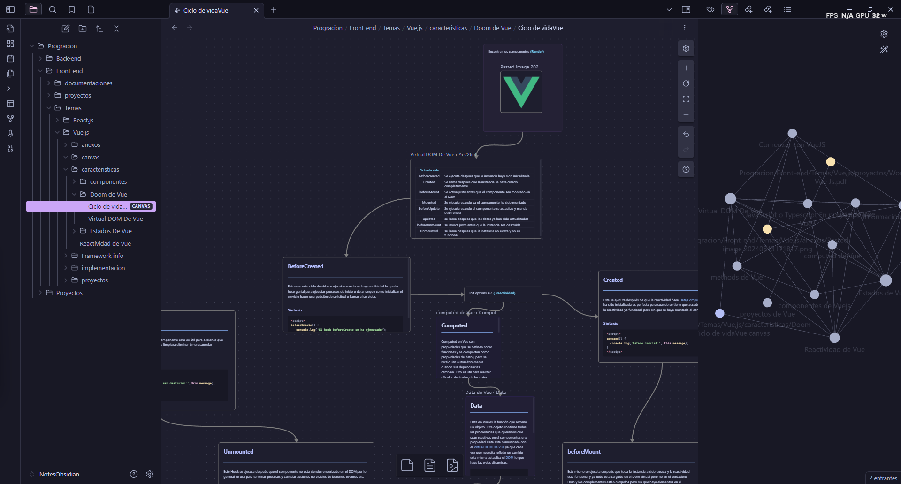

# Vue Proyects 🚀

## Descripción

Este repositorio Subire proyectos para probar mis habilidades y conocmiento sobre Vue, comenzando desde los conceptos básicos hasta llegar a un nivel avanzado. A lo largo de este proceso, iré documentando mi progreso y recopilando diversos recursos 
para y mostrar mi exelente trabajo.



## Contenidos

- **Proyectos:** Ejemplos y proyectos pequeños que voy desarrollando para practicar y aplicar lo aprendido.
- **Recursos Visuales:** Imágenes de mapas mentales, diagramas de flujo, y otros recursos visuales que utilizo para comprender conceptos clave.
- **Apuntes:** Notas y resúmenes que tomo durante mi proceso de aprendizaje.
- **Referencias:** Enlaces a artículos, tutoriales, videos y otros materiales que encuentro útiles.

## Estructura del Repositorio

- `/proyectos`: Carpeta que contiene proyectos prácticos desarrollados durante el aprendizaje.
- `/recursos-visuales`: Aquí se encuentran los mapas mentales, diagramas y otras imágenes relacionadas con Vue.js.
- `/apuntes`: Apuntes escritos sobre diferentes temas que estudio a lo largo del curso.
- `/referencias`: Recursos adicionales como enlaces a materiales educativos, tutoriales y más.

## Objetivo

Mi objetivo es avanzar en el dominio de Vue.js, desde lo más básico hasta llegar a un nivel avanzado, mediante la práctica constante, la documentación y la integración de diferentes tipos de recursos.

---

¡Gracias por visitar mi repositorio! Cualquier sugerencia o comentario es bienvenido.

inicia clonando con este link:
```bash
  https://github.com/Harolin-23/Proyects-Vue
  ```
