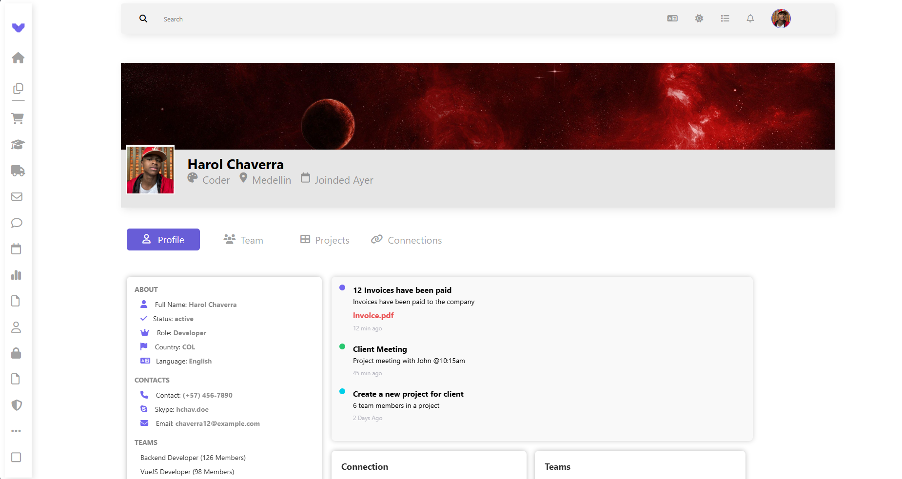
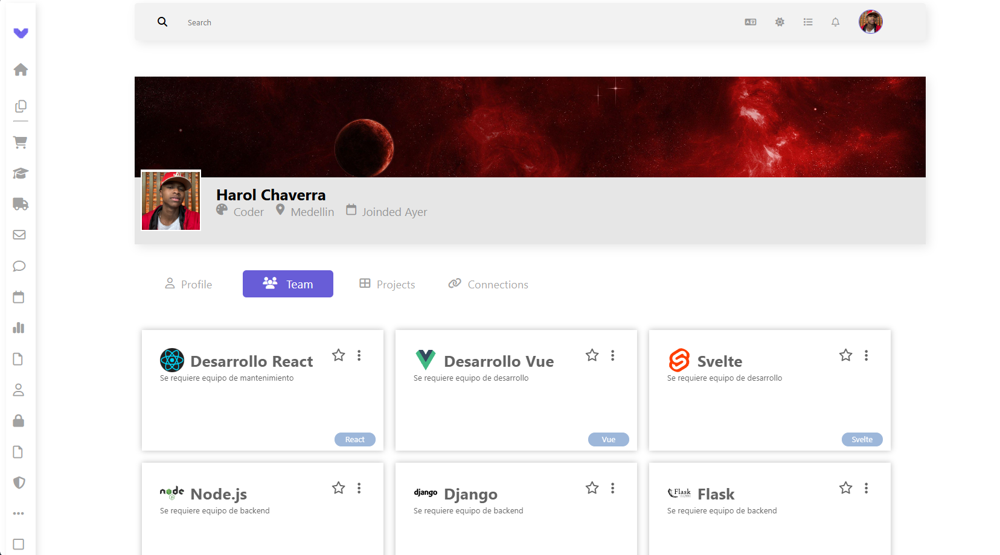
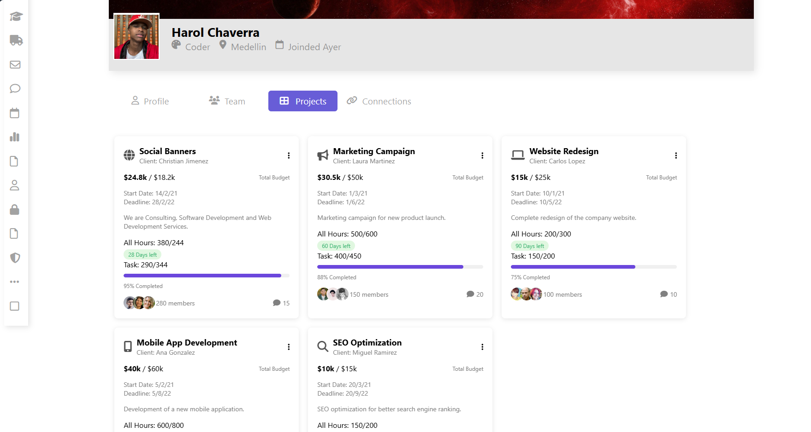
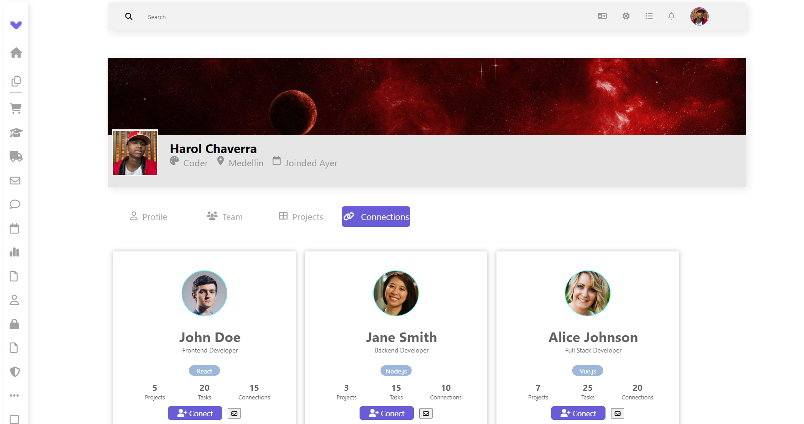

# Proyecto de Desarrollo Front-End para Riwi 🌐 

## Contexto

Riwi necesita una plataforma de conectividad profesional diseñada específicamente para sus desarrolladores. El objetivo principal es mejorar la experiencia y el manejo de la información del usuario dentro de su plataforma. Este proyecto implica la creación de un conjunto de interfaces de usuario que permitan a los usuarios gestionar sus perfiles, conexiones, proyectos y equipos de manera eficiente.

## Estructura del Proyecto

- **Perfil General**: Interfaz que muestra la información básica del usuario, incluyendo detalles personales, foto de perfil, y opciones de personalización.
- **Conexiones**: Página que permite a los usuarios gestionar sus conexiones profesionales, ver solicitudes pendientes y agregar nuevas conexiones.
- **Proyectos**: Interfaz dedicada a la visualización y gestión de proyectos en los que el usuario está involucrado, incluyendo opciones para crear y editar proyectos.
- **Equipos**: Página donde los usuarios pueden ver y gestionar los equipos a los que pertenecen, invitando a otros miembros y asignando roles dentro del equipo.

## Uso de Tecnologías

- **Vue.js**: Utilizado para la estructura y la lógica de la aplicación, implementando componentes reutilizables y siguiendo las mejores prácticas de desarrollo.
- **SASS**: Usado para la estilización de las interfaces, permitiendo una gestión más eficiente de los estilos a través de variables, mixins y anidaciones.

## Capturas de Pantalla

- **Perfil General**


- **Equipos**  


- **Proyectos**  


- **Conexiones**  


## Instalación y Configuración

1. Clona el repositorio:
   ```bash
   git clone https://github.com/tu-usuario/riwi-front-end.git
